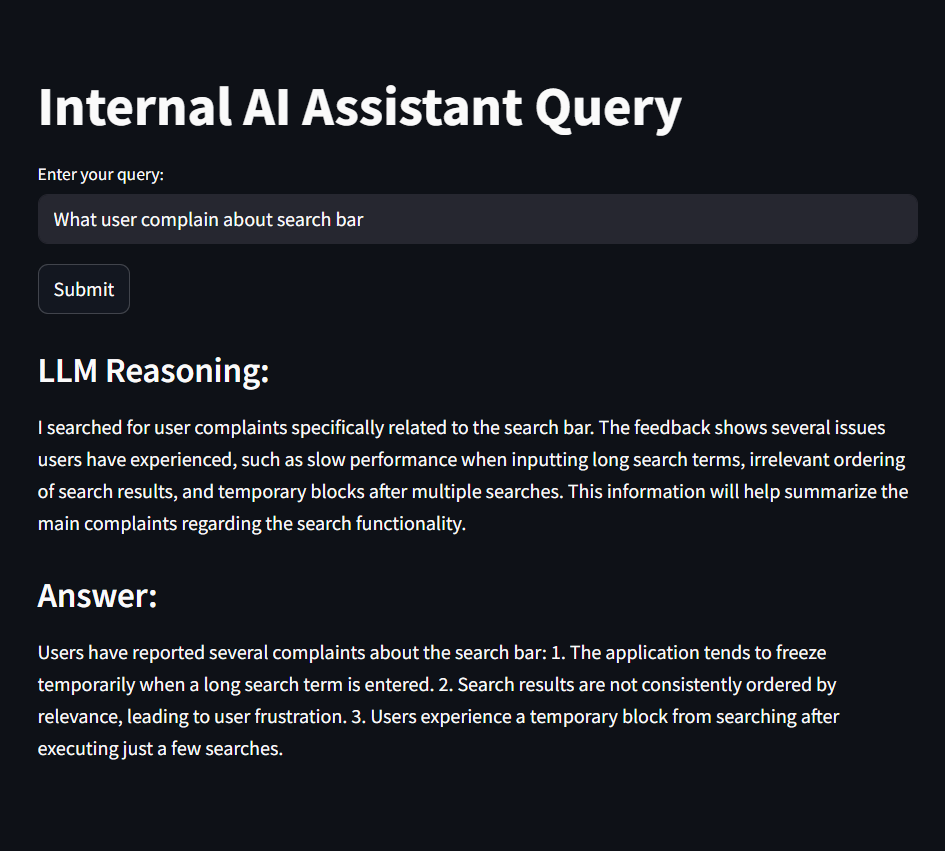

# InsightFixer

**InsightFixer** is an internal AI assistant that helps product and engineering teams resolve software bugs using agentic AI powered by internal knowledge sources such as bug reports and user feedback.



---

## Features

- Semantic search over internal bug reports and user feedback
- Intelligent summarization of issues using LLMs
- Agentic AI orchestration via LangGraph
- FastAPI backend with a single `/query` endpoint
- Optional Streamlit interface for visualization

---

## Installation

### 1. Clone the repository
```bash
git clone https://github.com/KiattiphumSuw/InsightFixer.git
cd InsightFixer
```
###  2. Start services with Docker
``` bash
docker compose up -d
```

### 3. Install dependencies using Poetry
``` bash
poetry install --no-root
```
### 4. Ingest internal bug data
``` bash
poetry run python src/ingestion/ingestion.py
```
### Optional: Run Streamlit UI
Launch the visual interface with:

``` bash
poetry run streamlit run streamlit_app.py
```
## API Usage
POST request to the FastAPI backend:

Endpoint: http://localhost:8000/api/v1/query
Payload:

``` json
{
  "query": "How to make upload 99% bug?"
}
```
Example Response:

``` json
{
  "response": "{\"reasoning\":\"...\",\"response\":\"...\"}"
}
```

## Project Structure
``` graphql
InsightFixer/
│
├── src/
│   ├── api/              # FastAPI routes
│   ├── core/             # LangGraph agent core logic
│   ├── ingestion/        # Data ingestion scripts
│   ├── tools/            # Agent tools (search, summarization)
│   └── common/           # Shared constants and prompts
│
├── streamlit_app.py      # Streamlit interface
├── docker-compose.yml    # Qdrant & service orchestration
└── README.md             # Project documentation
```

## Powered By
- LangChain + LangGraph for agentic AI logic
- Qdrant for vector-based semantic search
- OpenAI for embeddings and summarization
- FastAPI for serving queries
- Streamlit for interactive visualization

## License
This project is under the Apache License.