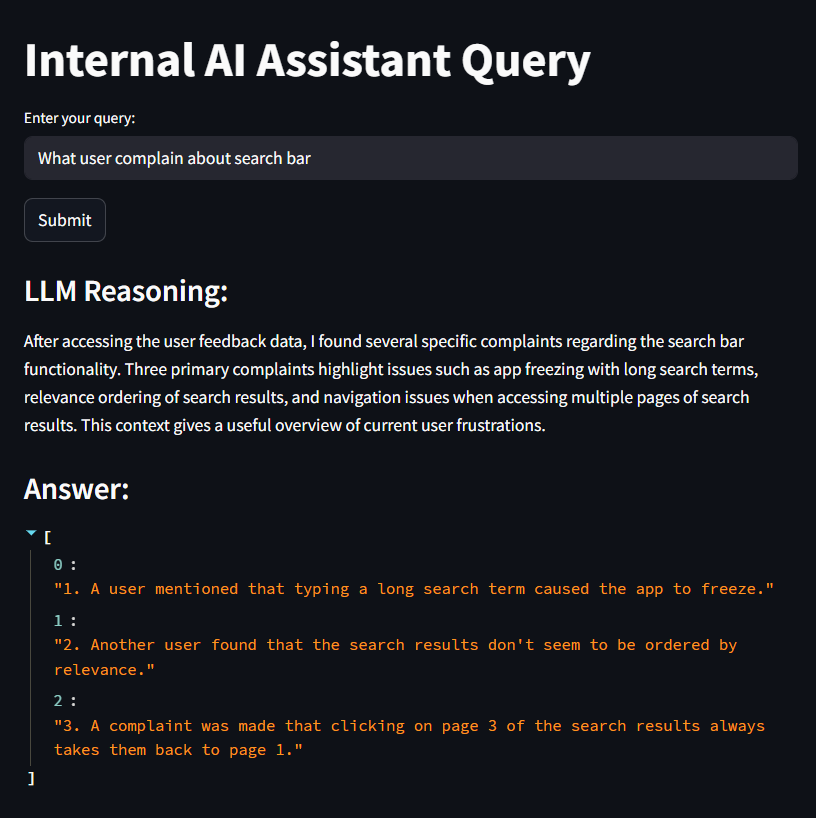
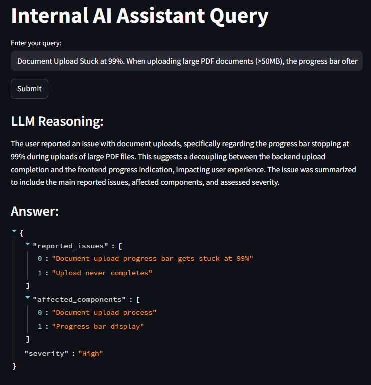

# InsightFixer
**InsightFixer** is an internal AI assistant designed to help product and engineering teams debug software issues. It leverages agentic AI workflows, powered by internal knowledge sources such as bug reports and user feedback.

## Use Cases
1. Question & Answer
InsightFixer answers queries about bugs using semantic search and reasoning over internal documentation.



2. Issue Summarization
Automatically extracts structured information—such as reported issues, affected components, and severity—from raw bug descriptions.

---

## Features

- Semantic search over internal bug reports and user feedback
- Intelligent summarization of issues using LLMs
- Agentic AI orchestration via LangGraph
- FastAPI backend with a single `/query` endpoint
- Optional Streamlit interface for visualization

---

## Installation

### 1. Clone the repository
```bash
git clone https://github.com/KiattiphumSuw/InsightFixer.git
cd InsightFixer
```

### 2. Create a .env file
``` txt
QDRANT_HOST=qdrant
QDRANT_PORT=6333
OPENAI_API_KEY=<your_openai_key>
```

### 3. Start services with Docker
``` bash
docker compose up -d
```

### 4. Install dependencies using Poetry
``` bash
poetry install --no-root
```
### 5. Ingest internal bug data
``` bash
poetry run python src/ingestion/ingest_data.py
```
### Optional: Run Streamlit UI
Launch the visual interface with:

``` bash
poetry run streamlit run streamlit_app.py
```
## API Usage
POST request to the FastAPI backend:

Endpoint: http://localhost:8000/api/v1/query
Payload:

``` json
{
  "query": "How to make upload 99% bug?"
}
```
Example Response:

``` json
{
  "response": "{\"reasoning\":\"...\",\"response\":\"...\"}"
}
```

## Project Structure
``` graphql
InsightFixer/
│
├── src/
│   ├── api/              # FastAPI routes
│   ├── core/             # LangGraph agent core logic
│   ├── ingestion/        # Data ingestion scripts
│   ├── tools/            # Agent tools (search, summarization)
│   └── common/           # Shared constants and prompts
│
├── streamlit_app.py      # Streamlit interface
├── docker-compose.yml    # Qdrant & service orchestration
└── README.md             # Project documentation
```

## Powered By
- LangChain + LangGraph for agentic AI logic
- Qdrant for vector-based semantic search
- OpenAI for embeddings and summarization
- FastAPI for serving queries
- Streamlit for interactive visualization

## License
This project is under the Apache License.